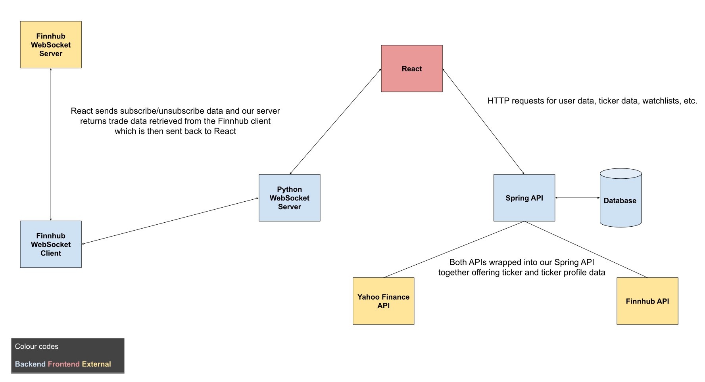

## 

## Real-time Stock Information & Visualisation App

---

Real-time stock information & visualisation. Built using Spring Boot, Python, React, React Native and Redux.

Two REST APIs are used, [Finnhub](https://finnhub.io/docs/api) and [Yahoo Finance](https://github.com/sstrickx/yahoofinance-api). These are wrapped in a Spring Boot REST API service which is called by a React front end application. This same
React frontend application also calls a Python streaming service (built using WebSockets) which can relay data from Finnhub's real-time stock information service.

> ### Note
>
> The React Native implementation is a work in progress and is not yet available for public distribution.

### Completed or potential/future features

- [x] Real-time stock information
- [x] Watchlist for registered users to track certain stock
- [x] Company information with stock data
- [ ] Stock visualisation
- [ ] Stock market news

---

### Technologies

- Spring Boot
- Maven
- Python
- React
- ReduxJS (with ReduxJS Toolkit)
- Bootstrap 4

### Finnhub and Yahoo Finance API usage limits

Finnhub offers 30 API calls/second while the Yahoo Finance API allows only 2000 requests/hour for their free tier.

Our solution around this is to limit the amount of tickers we can have and
cache the requests for data from the API using Spring Boot to control our outbound request rate.

See the [FinnhubService](src/main/java/com/ticker/service/FinnHubService.java) and [YahooFinanceService](src/main/java/com/ticker/service/YahooFinanceService.java) services for reference.

---

## Interactions high level overview

> 
>
> ---
>
> When users open the app through React, they create a connection to our Python WebSocket server and make requests to the Spring API.
> From the Spring API, we fetch the users account (if they are logged in), with that information, using both the Yahoo Finance and Finnhub API, we get the users watchlist of stocks (if they are logged in) and
> any data for stock symbols loaded.
>
> Any requests made for stock data from our Spring API are cached for a period of time, see the [CacheConfiguration](src/main/java/com/ticker/config/CacheConfiguration.java) file for reference.
> Any stock symbols loaded are also sent to our WebSocket which returns data to React to process.
> We subscribe/unsubscribe from these stocks in our WebSocket server based on whether or not users are using them.

---

##

## Development

Before you can build this project, you must install and configure the following dependencies on your machine:

1. [Node.js][]: We use Node to run a development web server and build the project.
   Depending on your system, you can install Node either from source or as a pre-packaged bundle.

After installing Node, you should be able to run the following command to install development tools.
You will only need to run this command when dependencies change in [package.json](package.json).

```
npm install
```

We use npm scripts and [Webpack][] as our build system.

If you are using hazelcast as a cache, you will have to launch a cache server.
To start your cache server, run:

```
docker-compose -f src/main/docker/hazelcast-management-center.yml up -d
```

Run the following commands in two separate terminals to create a blissful development experience where your browser
auto-refreshes when files change on your hard drive.

```
./mvnw
npm start
```

Npm is also used to manage CSS and JavaScript dependencies used in this application. You can upgrade dependencies by
specifying a newer version in [package.json](package.json). You can also run `npm update` and `npm install` to manage dependencies.
Add the `help` flag on any command to see how you can use it. For example, `npm help update`.

The `npm run` command will list all of the scripts available to run for this project.

### PWA Support

JHipster ships with PWA (Progressive Web App) support, and it's turned off by default. One of the main components of a PWA is a service worker.

The service worker initialization code is commented out by default. To enable it, uncomment the following code in `src/main/webapp/index.html`:

```html
<script>
  if ('serviceWorker' in navigator) {
    navigator.serviceWorker.register('./service-worker.js').then(function () {
      console.log('Service Worker Registered');
    });
  }
</script>
```

Note: [Workbox](https://developers.google.com/web/tools/workbox/) powers JHipster's service worker. It dynamically generates the `service-worker.js` file.

### Managing dependencies

For example, to add [Leaflet][] library as a runtime dependency of your application, you would run following command:

```
npm install --save --save-exact leaflet
```

To benefit from TypeScript type definitions from [DefinitelyTyped][] repository in development, you would run following command:

```
npm install --save-dev --save-exact @types/leaflet
```

Then you would import the JS and CSS files specified in library's installation instructions so that [Webpack][] knows about them:
Note: There are still a few other things remaining to do for Leaflet that we won't detail here.

For further instructions on how to develop with JHipster, have a look at [Using JHipster in development][].

## Setting up Python

Python is used for our WebSocket server.
For it to work, you need a version of [Python 3.7 or above](https://www.python.org/downloads/).
Once you have checked that you have the correct installation, finally, you will need to install the packages used from [requirements.txt](src/main/python/requirements.txt).

For example, you can install the packages like this from the root of the repository.

```
pip install -r src/main/python/requirements.txt
```

## Building for production

### Packaging as jar

To build the final jar and optimize the ticker application for production, run:

```
./mvnw -Pprod clean verify
```

This will concatenate and minify the client CSS and JavaScript files. It will also modify `index.html` so it references these new files.
To ensure everything worked, run:

```
java -jar target/*.jar
```

Then navigate to [http://localhost:8080](http://localhost:8080) in your browser.

Refer to [Using JHipster in production][] for more details.

### Packaging as war

To package your application as a war in order to deploy it to an application server, run:

```
./mvnw -Pprod,war clean verify
```

## Testing

To launch your application's tests, run:

```
./mvnw verify
```

### Client tests

Unit tests are run by [Jest][]. They're located in [src/test/javascript/](src/test/javascript/) and can be run with:

```
npm test
```

For more information, refer to the [Running tests page][].

### Code quality

Sonar is used to analyse code quality. You can start a local Sonar server (accessible on http://localhost:9001) with:

```
docker-compose -f src/main/docker/sonar.yml up -d
```

Note: we have turned off authentication in [src/main/docker/sonar.yml](src/main/docker/sonar.yml) for out of the box experience while trying out SonarQube, for real use cases turn it back on.

You can run a Sonar analysis with using the [sonar-scanner](https://docs.sonarqube.org/display/SCAN/Analyzing+with+SonarQube+Scanner) or by using the maven plugin.

Then, run a Sonar analysis:

```
./mvnw -Pprod clean verify sonar:sonar
```

If you need to re-run the Sonar phase, please be sure to specify at least the `initialize` phase since Sonar properties are loaded from the sonar-project.properties file.

```
./mvnw initialize sonar:sonar
```

For more information, refer to the [Code quality page][].

## Using Docker to simplify development (optional)

You can use Docker to improve your JHipster development experience. A number of docker-compose configuration are available in the [src/main/docker](src/main/docker) folder to launch required third party services.

For example, to start a postgresql database in a docker container, run:

```
docker-compose -f src/main/docker/postgresql.yml up -d
```

To stop it and remove the container, run:

```
docker-compose -f src/main/docker/postgresql.yml down
```

You can also fully dockerize your application and all the services that it depends on.
To achieve this, first build a docker image of your app by running:

```
./mvnw -Pprod verify jib:dockerBuild
```

Then run:

```
docker-compose -f src/main/docker/app.yml up -d
```

For more information refer to [Using Docker and Docker-Compose][], this page also contains information on the docker-compose sub-generator (`jhipster docker-compose`), which is able to generate docker configurations for one or several JHipster applications.

## Continuous Integration (optional)

To configure CI for your project, run the ci-cd sub-generator (`jhipster ci-cd`), this will let you generate configuration files for a number of Continuous Integration systems. Consult the [Setting up Continuous Integration][] page for more information.

[jhipster homepage and latest documentation]: https://www.jhipster.tech
[jhipster 7.1.0 archive]: https://www.jhipster.tech/documentation-archive/v7.1.0
[using jhipster in development]: https://www.jhipster.tech/documentation-archive/v7.1.0/development/
[service discovery and configuration with the jhipster-registry]: https://www.jhipster.tech/documentation-archive/v7.1.0/microservices-architecture/#jhipster-registry
[using docker and docker-compose]: https://www.jhipster.tech/documentation-archive/v7.1.0/docker-compose
[using jhipster in production]: https://www.jhipster.tech/documentation-archive/v7.1.0/production/
[running tests page]: https://www.jhipster.tech/documentation-archive/v7.1.0/running-tests/
[code quality page]: https://www.jhipster.tech/documentation-archive/v7.1.0/code-quality/
[setting up continuous integration]: https://www.jhipster.tech/documentation-archive/v7.1.0/setting-up-ci/
[node.js]: https://nodejs.org/
[webpack]: https://webpack.github.io/
[browsersync]: https://www.browsersync.io/
[jest]: https://facebook.github.io/jest/
[jasmine]: https://jasmine.github.io/2.0/introduction.html
[leaflet]: https://leafletjs.com/
[definitelytyped]: https://definitelytyped.org/
